# Hệ thống phát hiện và giám sát hành vi vi phạm giao thông bằng thị giác máy tính

Đồ án tốt nghiệp: nhận đầu vào là video/camera giám sát giao thông cố định, tự động phát hiện
phương tiện, theo dõi hành trình từng xe xuyên suốt khung hình, đối chiếu chuyển động của xe với
luật giao thông cụ thể của từng giao lộ (làn nào cho đi hướng nào, đèn tín hiệu nào áp dụng cho
làn/hướng nào, loại xe nào được phép vào làn nào...) để phát hiện và cảnh báo vi phạm gần thời
gian thực, đồng thời lưu lại bằng chứng (ảnh chụp, thời gian, biển số nếu đọc được) phục vụ tra
cứu và hậu kiểm.

<p align="center">
  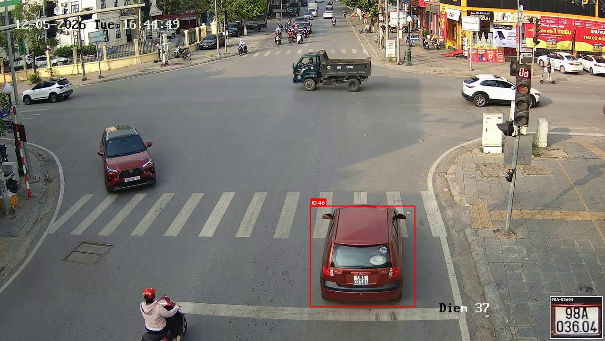
  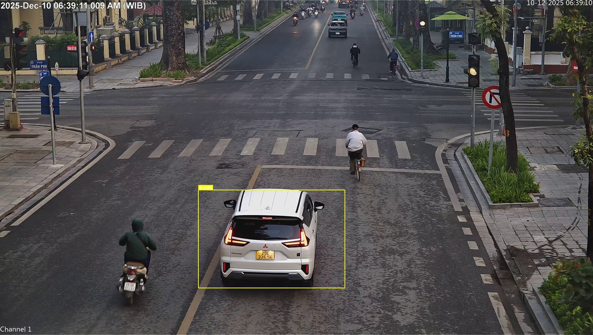
</p>
<p align="center">
  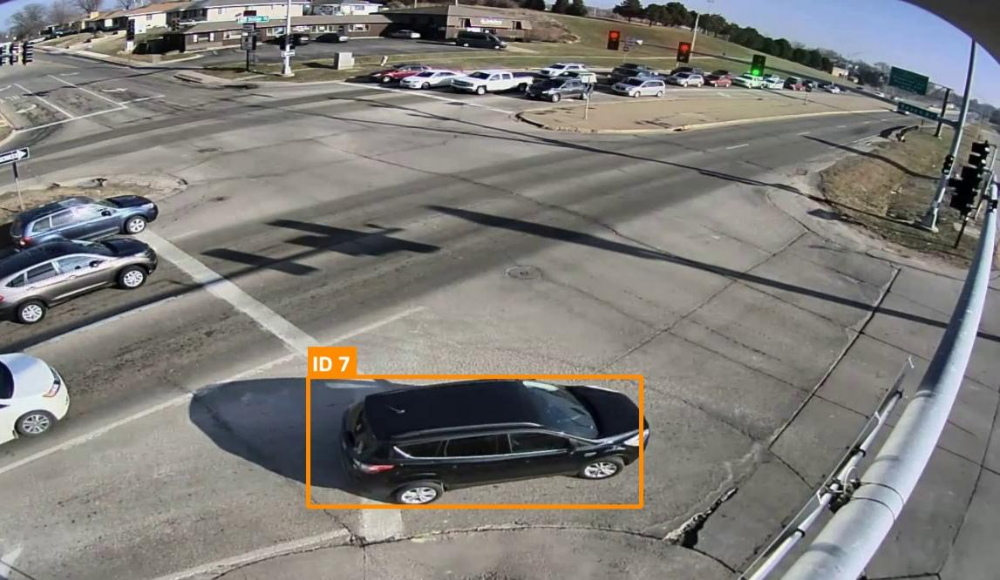
  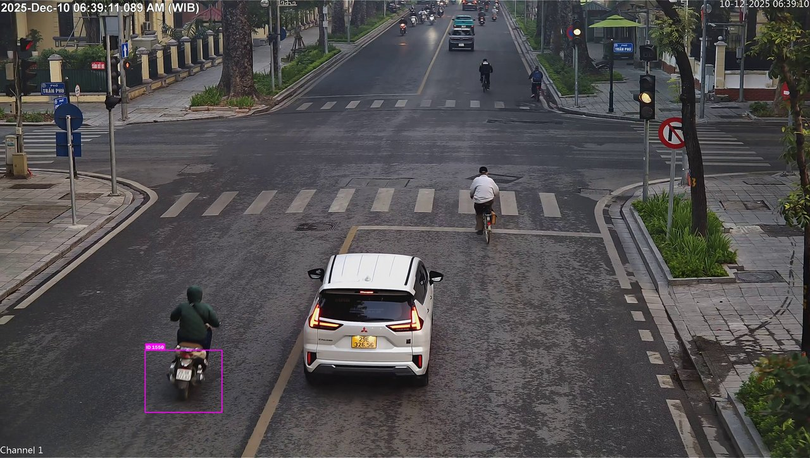
</p>
<p align="center">
  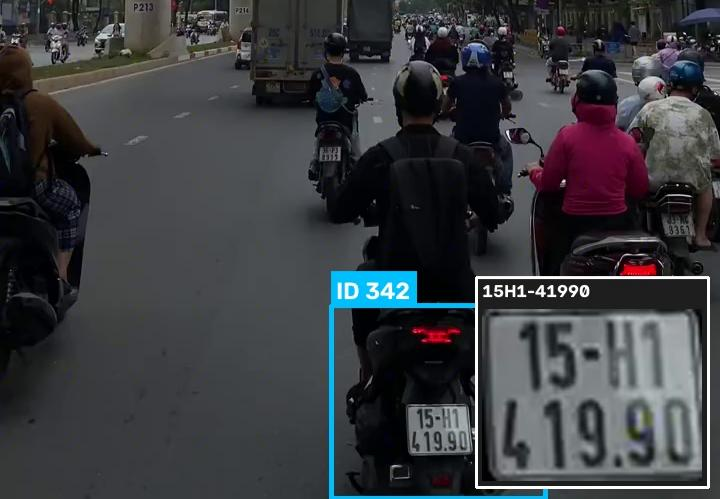
</p>

<sub>Ảnh chụp thật từ hệ thống — không dựng lại: khung màu quanh phương tiện đổi theo đúng loại
vi phạm (đỏ = vượt đèn đỏ, vàng = sai làn, cam = sai hướng rẽ, tím = ngược chiều, xanh dương =
không đội mũ bảo hiểm, kèm ảnh biển số đọc được phóng to ở góc dưới-phải).</sub>

---

## Mục lục

1. [Thực trạng & lý do thực hiện](#1-thực-trạng--lý-do-thực-hiện)
2. [Chức năng chính](#2-chức-năng-chính)
3. [Chi tiết 5 loại vi phạm được phát hiện](#3-chi-tiết-5-loại-vi-phạm-được-phát-hiện)
4. [Kiến trúc hệ thống](#4-kiến-trúc-hệ-thống)
5. [Công nghệ & mô hình sử dụng](#5-công-nghệ--mô-hình-sử-dụng)
6. [Yêu cầu hệ thống & cài đặt](#6-yêu-cầu-hệ-thống--cài-đặt)
7. [Cách chạy](#7-cách-chạy)
8. [Cấu hình cho 1 camera/video mới](#8-cấu-hình-cho-1-cameravideo-mới)
9. [Cấu trúc thư mục](#9-cấu-trúc-thư-mục)
10. [Dữ liệu huấn luyện mô hình mũ bảo hiểm](#10-dữ-liệu-huấn-luyện-mô-hình-mũ-bảo-hiểm)
11. [Kiểm chứng chất lượng](#11-kiểm-chứng-chất-lượng)
12. [Hướng phát triển tiếp theo](#12-hướng-phát-triển-tiếp-theo)

---

## 1. Thực trạng & lý do thực hiện

Vi phạm giao thông tại các nút giao (vượt đèn đỏ, đi sai làn, rẽ sai hướng, đi ngược chiều, không
đội mũ bảo hiểm) là nguyên nhân trực tiếp gây tai nạn và ùn tắc. Việc giám sát bằng con người
(cảnh sát trực chốt, xem lại camera thủ công) tốn nhiều nhân lực, không thể phủ hết mọi giao lộ
cùng lúc, và dễ bỏ sót vi phạm xảy ra nhanh/ở góc khuất. Camera giám sát giao thông đã được lắp
đặt phổ biến ở nhiều nút giao tại các đô thị, nhưng phần lớn chỉ dùng để ghi hình và xem lại khi
cần (hậu kiểm thủ công), chưa có khả năng tự động phát hiện và cảnh báo vi phạm theo thời gian
thực.

Hệ thống trong đồ án này giải quyết vấn đề trên bằng cách:

1. **Giảm phụ thuộc nhân lực trực chốt** — hệ thống tự chạy liên tục, chỉ cần con người xem xét
   lại khi có cảnh báo hoặc khi cần xác nhận thủ công.
2. **Mở rộng ra nhiều giao lộ chỉ bằng cấu hình lại**, không cần viết lại phần mềm cho từng nơi —
   toàn bộ hiểu biết về hình học (làn, vạch, đèn) và luật lệ riêng của 1 giao lộ được tách hết ra
   khỏi code, đưa vào 1 file cấu hình JSON.
3. **Tạo bằng chứng khách quan** — ảnh chụp, thời gian, biển số rõ ràng cho mỗi vi phạm, giảm
   tranh cãi so với chỉ dựa vào lời khai.
4. **Là nền dữ liệu cho các bài toán lớn hơn** sau này — phân tích lưu lượng giao thông theo thời
   gian, xác định điểm nóng vi phạm, phục vụ quy hoạch giao thông.

Hệ thống nhắm tới việc triển khai tại các nút giao đã có sẵn hạ tầng camera cố định, xử lý trực
tiếp luồng video từ camera đó mà **không yêu cầu phần cứng chuyên dụng đắt tiền** — đã kiểm chứng
chạy đạt tốc độ thời gian thực trên GPU phổ thông (NVIDIA RTX 3050, 4GB VRAM).

## 2. Chức năng chính

| Nhóm | Mô tả |
|---|---|
| Phát hiện & theo dõi phương tiện | Nhận diện 5 loại xe (ô tô, xe máy, xe buýt, xe tải, xe đạp), gán và giữ ổn định 1 mã theo dõi (track ID) riêng cho từng xe xuyên suốt thời gian xe xuất hiện trong khung hình, kể cả khi bị che khuất tạm thời. |
| Cấu hình linh hoạt theo từng camera | Vùng nhận diện, làn đường, vạch dừng, vạch xác định hướng rẽ, vector hướng lưu thông đúng, vùng đèn tín hiệu — tất cả khai báo trong 1 file JSON, không đụng vào code khi thêm 1 giao lộ mới. Có **Config Wizard** 9 bước ngay trên trình duyệt: vẽ vùng/vạch bằng chuột lên đúng khung hình video đó, gán hướng cho làn, cài đặt đèn tín hiệu (kèm miễn trừ vượt đèn đỏ theo loại xe cho từng hướng riêng — ví dụ xe máy vẫn được đi tiếp khi đèn đỏ ở 1 hướng cụ thể dù ô tô thì không), vector hướng, và bật/tắt từng layer hiển thị — không cần tính tay toạ độ pixel hay sửa JSON thô. |
| Đèn tín hiệu | Đọc màu đèn thực tế bằng ngưỡng màu HSV trên vùng ảnh khoanh vùng đèn (có bộ lọc chống nhiễu "quay ngược" khi màu đọc sai chớp nhoáng), hoặc mô phỏng chu kỳ đỏ/vàng/xanh cố định cho trường hợp không thể đọc màu thật (góc quay khuất, đèn quá nhỏ). |
| 5 loại vi phạm | Xem chi tiết thuật toán từng loại ở [mục 3](#3-chi-tiết-5-loại-vi-phạm-được-phát-hiện). |
| Đọc biển số xe | Phát hiện và đọc ký tự biển số (1 dòng hoặc 2 dòng), gắn kèm vào mỗi phương tiện và mỗi vi phạm nếu đọc được. |
| Cảnh báo ùn tắc | Đếm số phương tiện trong 1 vùng theo thời gian, cảnh báo khi vượt ngưỡng số xe VÀ duy trì đủ lâu (tránh báo sai vì 1 nhóm xe đông nhất thời lúc dừng đèn đỏ rồi giải tán ngay). |
| Tuỳ chỉnh hiển thị overlay | Bật/tắt riêng từng layer vẽ lên video (vùng, vạch, quỹ đạo di chuyển) để chỉ giữ lại khung bao phương tiện nếu muốn nhìn gọn hơn; có thể bật thêm khung khoanh đúng vùng biển số/vùng mũ bảo hiểm vừa nhận diện (khác nhãn chữ/đổi màu khung xe đã có sẵn) — khung tự bám theo xe di chuyển giữa các lần model chạy (throttle) mà không cần chạy lại model mỗi khung hình. |
| Ghi log & bằng chứng | Mỗi vi phạm được ghi 1 dòng vào log CSV/JSON kèm thời gian, loại xe, biển số, đường dẫn ảnh minh chứng; mỗi phương tiện có 1 dòng tổng kết riêng (loại xe, làn xuất phát, biển số, đã vi phạm gì). |
| Xem xét thủ công | Sau khi xem lại kết quả, người dùng có thể xác nhận 1 vi phạm là đúng, đánh dấu là lỗi nhận diện/được ưu tiên bỏ qua, hoặc bổ sung 1 vi phạm bị hệ thống bỏ sót — mọi thay đổi đều lưu vết (không xoá âm thầm). |
| Web UI | Trang chủ giới thiệu hệ thống, "Màn hình giám sát chung" xem trực tiếp nhiều camera cùng lúc (dạng lưới), trang riêng cho từng camera (video + bảng thống kê + log vi phạm cập nhật theo thời gian thực, đồng bộ lại đúng vị trí khi tua video phát lại), "Hồ sơ vi phạm" tổng hợp mọi vi phạm toàn hệ thống có bộ lọc, "Báo cáo & Thống kê" (biểu đồ theo loại/camera/ngày/giờ), "Nhật ký hệ thống AI" (lịch sử mọi lần chạy, không mất khi chạy lại), quản lý cấu hình (đọc/sửa/xoá/tạo bằng Wizard), tải log ra CSV hoặc Excel. Giao diện song ngữ Việt/Anh, hỗ trợ giao diện sáng/tối. |

**Đã hoãn nhưng không bỏ**: luồng "phạt nguội" hoàn chỉnh — từ vi phạm đã ghi nhận, tra cứu cơ sở
dữ liệu đăng ký xe/dân cư để tìm chủ phương tiện, tự động sinh biên bản vi phạm, gửi thông báo về
cho chủ xe. Đây là hướng mở rộng đã được lên kế hoạch nhưng ưu tiên sau các hạng mục bắt buộc của
đồ án (huấn luyện mô hình, đánh giá, viết báo cáo).

## 3. Chi tiết 5 loại vi phạm được phát hiện

### Vượt đèn đỏ

Xác nhận khi xe cắt qua vạch dừng của 1 làn đúng lúc đèn tín hiệu áp dụng cho làn đó đang đỏ. Hỗ
trợ 3 tình huống nâng cao thường gặp trong thực tế:

- **Rẽ theo 1 hướng cụ thể khi đèn đỏ, nếu luật cho phép** (ví dụ rẽ phải khi đèn đỏ) — nếu làn đó
  chuyên dụng đúng 1 hướng thì biết chắc ngay lúc cắt vạch; nếu làn cho nhiều hướng (không đủ
  thông tin xác định hướng thật ngay lúc đó), hệ thống ghi nhận tạm thời rồi tiếp tục theo dõi xe
  đến khi cắt qua vạch xác định hướng rẽ thật — nếu đúng hướng được miễn trừ, vi phạm tạm thời đó
  được rút lại (vẫn lưu vết là đã từng ghi nhận rồi rút lại, không xoá âm thầm).
- **Nhiều đèn tín hiệu cùng điều khiển 1 làn theo các hướng khác nhau** (ví dụ đèn mũi tên rẽ trái
  riêng, đèn tròn đi thẳng riêng — có thể khác trạng thái tại cùng 1 thời điểm).
- **Ngoại lệ theo loại phương tiện** (ví dụ 1 số nơi cho phép xe máy đi tiếp ở làn rẽ phải dù đèn
  đỏ theo quy định riêng).

<p align="center">
  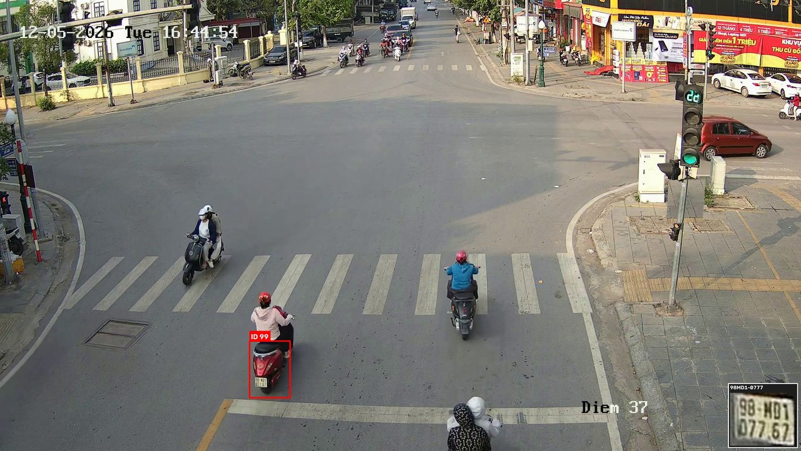
</p>
<p align="center"><sub>Vi phạm vượt đèn đỏ, kèm đọc được biển số (ảnh phóng to góc dưới-phải).</sub></p>

### Đi sai làn theo loại phương tiện

Mỗi làn đường có thể giới hạn loại xe được phép đi vào (ví dụ cấm xe tải/xe khách vào làn hỗn hợp
dành cho xe máy). Để tránh báo sai khi xe chỉ cắt ngang qua làn cấm để đổi làn, hệ thống chỉ xác
nhận vi phạm sau khi xe đã di chuyển liên tục trong làn cấm đủ lâu (đủ số khung hình liên tiếp
HOẶC đủ quãng đường di chuyển), và bỏ qua hẳn các khung hình đầu tiên ngay sau khi 1 xe mới xuất
hiện (giai đoạn dễ nhiễu vị trí/phân loại nhất của bất kỳ hệ thống theo dõi đa đối tượng nào).

### Rẽ sai hướng quy định của làn

Mỗi làn có thể chỉ cho phép 1 hoặc vài hướng rẽ cụ thể (thẳng/trái/phải). Hệ thống ghi nhớ làn
xuất phát của xe khi mới xuất hiện, sau đó xác định hướng đi thực tế bằng cách xem xe cắt qua vạch
xác định hướng nào khi thoát khỏi giao lộ, rồi đối chiếu với danh sách hướng được phép của đúng
làn xuất phát đó.

### Đi ngược chiều

So sánh vector chuyển động thực tế của xe với vector hướng lưu thông đúng đã khai báo riêng cho
làn mà xe đang ở trong đó — không so với 1 hướng chung duy nhất cho toàn bộ khung hình, để không
nhầm lẫn giữa các làn có hướng lưu thông ngược nhau (ví dụ đường 2 chiều). Chỉ tính là vi phạm khi
góc lệch giữa 2 vector đủ lớn (tương đương lệch hơn khoảng 120 độ) và xe đã di chuyển đủ xa/đủ lâu
để loại trừ nhiễu rung lắc của khung bao (bounding box).

### Không đội mũ bảo hiểm

Áp dụng cho mọi xe máy phát hiện được trong vùng nhận diện, không giới hạn theo làn/hướng đi (đúng
tinh thần luật giao thông: bắt buộc đội mũ bảo hiểm bất kể đang đi ở làn hay chiều nào). Dùng 1 mô
hình phân loại ảnh riêng (không phải hình học như 4 rule trên) chạy trên phần ảnh cắt ra quanh
đầu người lái, xác nhận qua nhiều lần quan sát liên tiếp theo cơ chế bỏ phiếu đa số (không chỉ dựa
vào đúng 1 khung hình, tránh báo sai vì 1 khung hình nhiễu thoáng qua như bóng râm/góc khuất), và
có thể tự rút lại nếu bằng chứng sau đó cho thấy phán đoán ban đầu sai.

## 4. Kiến trúc hệ thống

Hệ thống tách thành 3 lớp độc lập, không phụ thuộc chồng chéo lẫn nhau:

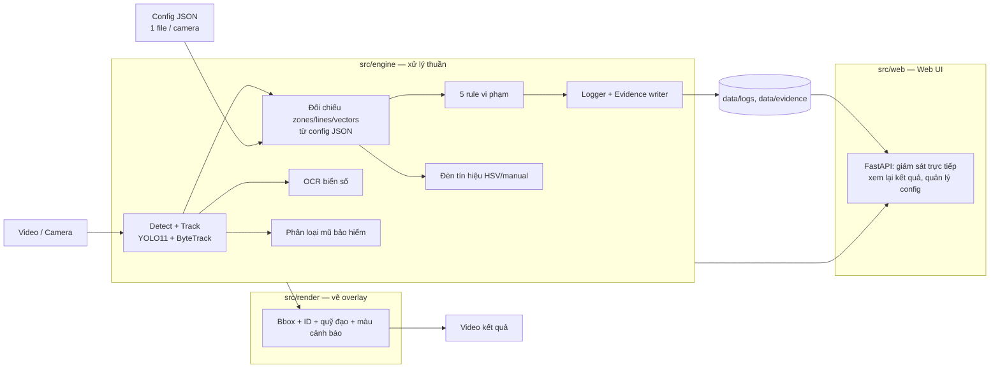
```mermaid
flowchart LR
    subgraph Engine["src/engine — xử lý thuần"]
        A[Detect + Track<br/>YOLO11 + ByteTrack] --> B[Đối chiếu zones/lines/vectors<br/>từ config JSON]
        B --> C[5 rule vi phạm]
        B --> D[Đèn tín hiệu HSV/manual]
        A --> E[OCR biển số]
        A --> F[Phân loại mũ bảo hiểm]
        C --> G[Logger + Evidence writer]
    end
    subgraph Render["src/render — vẽ overlay"]
        H[Bbox + ID + quỹ đạo + màu cảnh báo]
    end
    subgraph Web["src/web — Web UI"]
        I[FastAPI: giám sát trực tiếp<br/>xem lại kết quả, quản lý config]
    end

    V[Video / Camera] --> A
    Z[Config JSON<br/>1 file / camera] --> B
    Engine --> H
    H --> J[Video kết quả]
    Engine --> I
    G --> K[(data/logs, data/evidence)]
    K --> I
```

- **`src/engine/`** — xử lý thuần tuý: phát hiện, theo dõi, đối chiếu hình học với config, chạy 5
  rule vi phạm, đọc đèn tín hiệu, OCR biển số, phân loại mũ bảo hiểm. Hoàn toàn không biết gì về
  cách hiển thị — chỉ phát ra dữ liệu có cấu trúc (danh sách vi phạm, số liệu thống kê).
- **`src/render/`** — nhận dữ liệu từ engine, vẽ đè lên khung hình video: vùng mờ, khung bao xe,
  mã theo dõi, quỹ đạo di chuyển, màu và nhãn cảnh báo theo đúng loại vi phạm.
- **`src/web/`** — lớp mỏng bọc quanh engine (FastAPI + giao diện web thuần JavaScript), không
  sửa đổi engine — cho phép giám sát nhiều camera, xem lại lịch sử, quản lý cấu hình qua trình
  duyệt.

Bảng thống kê và log vi phạm **không được "nướng" (bake) trực tiếp vào pixel của video** — luôn
là dữ liệu tách rời khỏi hình ảnh, để hiển thị cục bộ (cửa sổ preview) hay trên web đều đọc chung
1 nguồn dữ liệu, không phải viết và duy trì 2 lần.

## 5. Công nghệ & mô hình sử dụng

| Thành phần | Công nghệ / Model | Ghi chú |
|---|---|---|
| Phát hiện phương tiện | YOLO11 (Ultralytics), pretrained trên COCO | Đã có sẵn đủ lớp xe cần thiết, không cần train từ đầu |
| Theo dõi đa đối tượng | ByteTrack (tích hợp sẵn trong Ultralytics) | Không tự viết tracker — tracker Python thuần chạy rất chậm |
| Đèn tín hiệu | Lọc ngưỡng màu HSV trên vùng ảnh khoanh vùng đèn | Không cần huấn luyện model riêng |
| 5 rule vi phạm | Hình học thuần: kiểm tra điểm trong đa giác, giao cắt đoạn thẳng, tích vô hướng vector | Không cần huấn luyện, chạy tức thời, dễ giải thích và kiểm chứng kết quả |
| Đọc biển số | 2 mô hình YOLOv5 (phát hiện vùng biển số + đọc ký tự) | Kế thừa từ [trungdinh22/License-Plate-Recognition](https://github.com/trungdinh22/License-Plate-Recognition), đã được kiểm chứng hoạt động đúng |
| Phân loại mũ bảo hiểm | YOLOv8, tự thu thập dữ liệu và fine-tune trên Google Colab (5 kiến trúc đã thử, chọn nhánh tốt nhất) | Xem [mục 10](#10-dữ-liệu-huấn-luyện-mô-hình-mũ-bảo-hiểm) |

## 6. Yêu cầu hệ thống & cài đặt

**Yêu cầu**:
- Python 3.10
- GPU NVIDIA hỗ trợ CUDA (đã kiểm chứng chạy tốc độ thời gian thực trên RTX 3050, 4GB VRAM). Vẫn
  chạy được trên CPU nhưng không đạt tốc độ thời gian thực.

**Cài đặt**:

```bash
python -m venv .venv
.venv\Scripts\activate        # Windows
# source .venv/bin/activate   # Linux/macOS

# PyTorch bản CUDA — cài riêng TRƯỚC pip install -r requirements.txt, vì phải chọn đúng bản CUDA
# theo từng máy (không thể cố định trong requirements.txt). Bản đã kiểm chứng dùng trong đồ án:
pip install torch==2.6.0+cu124 torchvision==0.21.0+cu124 --index-url https://download.pytorch.org/whl/cu124

pip install -r requirements.txt
```

**Không muốn tự cài Python/CUDA/torch thủ công** — xem [DOCKER.md](DOCKER.md) để chạy bằng Docker
(đóng gói sẵn toàn bộ môi trường, chỉ cần cài Docker).

## 7. Cách chạy

**Dòng lệnh (CLI)** — xử lý 1 video, chỉ cần gọi đúng tên (hệ thống tự suy ra đường dẫn video,
config, và nơi lưu kết quả theo quy ước ở [mục 8](#8-cấu-hình-cho-1-cameravideo-mới)):

```bash
python main.py vid_test                    # xử lý, lưu video kết quả vào data/output/
python main.py vid_test --show             # xem preview trực tiếp, không lưu file
python main.py vid_test --max-frames 200   # debug nhanh 200 khung hình đầu
```

**Web UI**:

```bash
python run_web.py
```

rồi mở `http://localhost:8000` trên trình duyệt. Giao diện gồm 5 trang chính:

| Trang | Nội dung |
|---|---|
| **Trang chủ** | Video nền thật (đã xử lý, có overlay) + giới thiệu ngắn gọn hệ thống, lối vào nhanh 3 trang còn lại. |
| **Màn hình giám sát chung** | Lưới toàn bộ camera trong hệ thống — camera đang xử lý tự hiện snapshot trực tiếp ngay trên lưới, không cần bấm vào mới xem được. Thêm nguồn video mới bằng 3 cách: tải file từ máy (kéo-thả hoặc chọn file), dán link tải trực tiếp, hoặc xem trực tiếp webcam (detect + theo dõi phương tiện thô, chưa gán làn/luật). |
| **Trang chi tiết 1 camera** | Tự đổi giao diện theo trạng thái: chưa có cấu hình → xem video gốc trước; đã có cấu hình → nút "Bắt đầu xử lý" hoặc mở Config Wizard/sửa JSON; đang xử lý → video trực tiếp kèm log vi phạm + bảng thống kê cập nhật theo thời gian thực (SSE); đã có kết quả → phát lại kèm log/thống kê tự đồng bộ đúng vị trí đang xem, bấm vào ảnh minh chứng hoặc dòng log để tua thẳng tới đúng thời điểm, xem xét/chỉnh sửa thủ công từng vi phạm. |
| **Hồ sơ vi phạm** | Bảng tổng hợp mọi vi phạm từ mọi camera, có bộ lọc theo loại/camera/thời gian, bấm vào để nhảy thẳng tới đúng camera + thời điểm. |
| **Báo cáo & Thống kê** | Biểu đồ (tròn/cột) vi phạm theo loại, theo camera, theo ngày/giờ trong ngày, tỉ lệ vi phạm/tổng phương tiện theo camera, bảng ùn tắc; xuất CSV/Excel. |
| **Nhật ký hệ thống AI** | Lịch sử toàn bộ lần xử lý + toàn bộ phương tiện đã từng ghi nhận, lưu **nối tiếp** (chạy lại 1 camera không làm mất lịch sử các lần chạy trước), có bộ lọc/sắp xếp theo từng cột. |

<p align="center">
  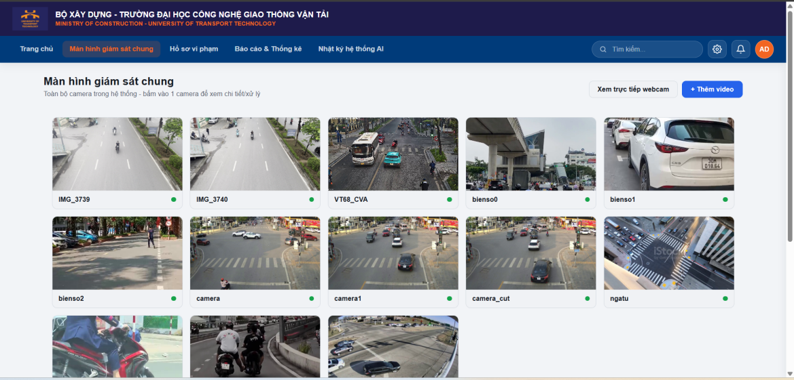
</p>
<p align="center"><sub>Trang "Màn hình giám sát chung" — camera đang xử lý tự hiện snapshot trực tiếp ngay trên lưới.</sub></p>

Video kết quả xem trực tiếp/phát lại đều là overlay thật do chính engine vẽ ra (bbox, mã theo dõi,
màu cảnh báo vi phạm, khung biển số/mũ bảo hiểm nếu bật) — không phải dựng/mô phỏng riêng cho giao
diện.

<p align="center">
  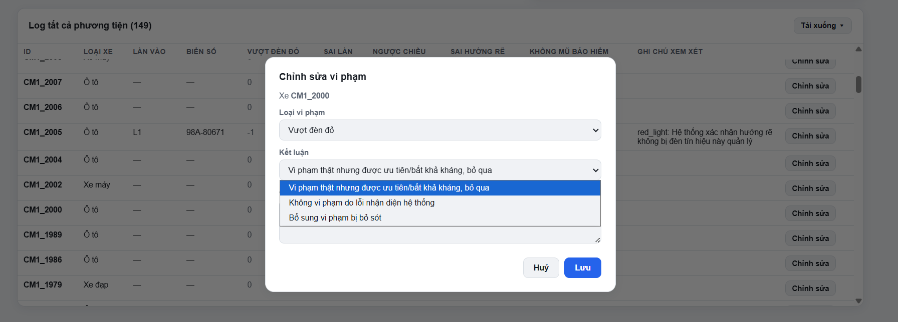
</p>
<p align="center"><sub>Bảng log tất cả phương tiện (dữ liệu thật) kèm cơ chế xem xét thủ công — xác nhận vi phạm đúng, đánh dấu lỗi nhận diện, hoặc bổ sung vi phạm bị bỏ sót, mọi thay đổi đều lưu vết lý do.</sub></p>

## 8. Cấu hình cho 1 camera/video mới

Mỗi video cần đúng 1 file cấu hình JSON đặt cạnh nhau theo quy ước đặt tên:

```
data/input/<ten_video>.<duoi_file>     <-->     config/videos/<ten_video>.json
```

Bên trong file cấu hình, `meta.video_name` phải khớp chính xác tên file video — hệ thống sẽ báo
lỗi rõ ràng ngay khi nạp cấu hình nếu bị lệch, thay vì chạy sai một cách âm thầm.

File cấu hình gồm các khối chính:

- **`zones`** — các vùng đa giác theo toạ độ pixel: vùng giới hạn phạm vi nhận diện, làn đường
  (kèm luật riêng: loại xe được phép, hướng được phép), vùng kiểm tra ngược chiều, vùng chứa đèn
  tín hiệu.
- **`lines`** — vạch dừng (gắn với 1 làn cụ thể) và vạch xác định hướng thoát khi rẽ.
- **`traffic_lights`** — khai báo đèn tín hiệu áp dụng cho làn/hướng nào, đọc màu thật (kèm dải
  màu HSV) hoặc mô phỏng chu kỳ cố định.
- **`vectors`** — hướng lưu thông đúng của từng làn, dùng để phát hiện đi ngược chiều.
- **`system`** — bật/tắt từng loại vi phạm, tham số kỹ thuật (ngưỡng phát hiện, tracker, điểm neo
  hình học, cấu hình ùn tắc...).

Với 1 giao lộ hoàn toàn mới chưa có cấu hình, cách nhanh nhất là dùng **Config Wizard** trên Web
UI (dropdown "Cấu hình" ở trang chi tiết camera) — vẽ trực tiếp bằng chuột lên đúng khung hình của
video đó qua 9 bước: thông tin chung → loại xe → vùng (zones) → vạch (lines) → gán hướng cho từng
làn → đèn tín hiệu (đọc màu HSV bằng cách click trực tiếp vào bóng đèn trên canvas, kèm miễn trừ
theo loại xe cho từng hướng đèn quản lý) → vector hướng lưu thông → tham số hệ thống (bật/tắt tính
năng, ngưỡng kỹ thuật, bật/tắt từng layer hiển thị) → xem lại & lưu. Hệ thống tự sinh toạ độ và
file JSON hoàn chỉnh, không cần tính tay toạ độ pixel; mở lại Wizard trên 1 camera đã có cấu hình
sẽ nạp lại đúng dữ liệu cũ để sửa tiếp thay vì phải làm lại từ đầu.

<p align="center">
  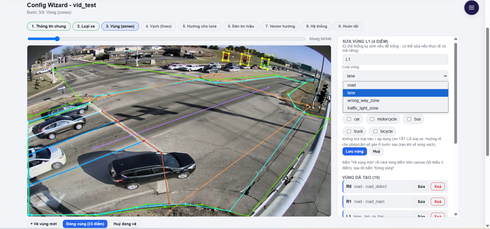
</p>
<p align="center"><sub>Bước vẽ vùng (zones) của Config Wizard — click trực tiếp lên khung hình video thật, không cần tính tay toạ độ pixel.</sub></p>

<p align="center">
  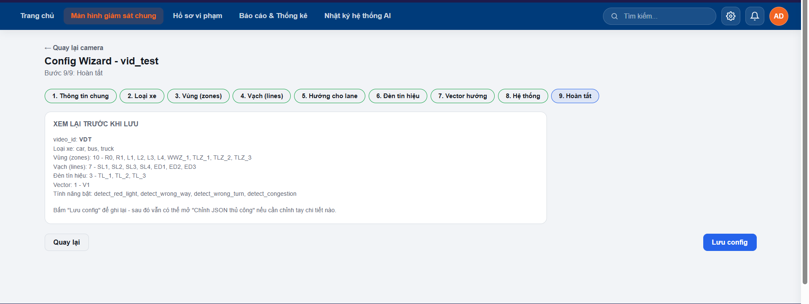
</p>
<p align="center"><sub>Bước cuối (9/9) — xem lại tóm tắt toàn bộ cấu hình vừa khai báo qua 9 bước trước khi lưu thành file JSON.</sub></p>

## 9. Cấu trúc thư mục

```
DATN/
├── main.py                     # CLI: python main.py <ten_video>
├── run_web.py                  # Entry point Web UI — python run_web.py
├── requirements.txt
│
├── third_party/yolov5/         # Vendor YOLOv5 — phục vụ 2 model đọc biển số
│
├── src/
│   ├── engine/                 # Detect/track/rules/OCR/đèn tín hiệu — xử lý thuần
│   │   └── rules/              # Mỗi loại vi phạm 1 file riêng
│   ├── render/                 # Vẽ overlay lên video
│   └── web/                    # FastAPI + giao diện web
│
├── config/
│   ├── videos/                  # 1 file JSON cấu hình / video, tên phải khớp video
│   └── CONFIG_GUIDE.md          # Hướng dẫn đầy đủ từng khối config, kèm ví dụ luật giao thông thật
│
├── data/
│   ├── input/                  # Video gốc
│   ├── output/                 # Video đã xử lý (kèm khung bao/ID/cảnh báo)
│   ├── logs/<ten>/              # events.csv/json, vehicle_summary.csv, thống kê lưu lượng
│   ├── evidence/<ten>/<loai>/   # Ảnh minh chứng vi phạm
│   └── thumbnails/              # Ảnh đại diện cho dashboard Web UI
│
├── models/pretrained/           # Các model YOLO đã huấn luyện/fine-tune
├── eval/                        # Công cụ đánh giá/chẩn đoán (FPS, chất lượng theo dõi...)
└── docs/                        # Tài liệu đồ án (mô tả bài toán, kiến trúc, nhật ký kỹ thuật)
```

## 10. Dữ liệu huấn luyện mô hình mũ bảo hiểm

Vì chưa có sẵn model phát hiện đội/không đội mũ bảo hiểm phù hợp, đã **tự thu thập dữ liệu từ nhiều nguồn và gán nhãn dữ liệu** rồi fine-tune mô hình YOLO11 trên Google Colab. Bộ dữ liệu được công khai tại
Roboflow Universe:

**[https://universe.roboflow.com/van-dqben/data_hetmet](https://universe.roboflow.com/van-dqben/data_hetmet)**
— 2 lớp nhãn: `helmet` (có đội mũ bảo hiểm) và `no_helmet` (không đội mũ bảo hiểm).

<p align="center">
  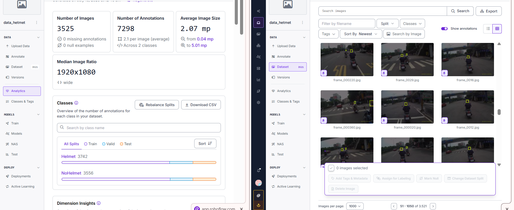
</p>
<p align="center"><sub>Bộ dữ liệu trên Roboflow — 3525 ảnh, 7298 lượt gán nhãn, 2 lớp <code>Helmet</code>/<code>NoHelmet</code>.</sub></p>

### Nguồn gốc mô hình & 5 kiến trúc đã thử nghiệm

Mô hình đọc biển số (`LP_detector.pt`/`LP_ocr.pt`) kế thừa từ repo
[trungdinh22/License-Plate-Recognition](https://github.com/trungdinh22/License-Plate-Recognition).
Mô hình mũ bảo hiểm dùng lại checkpoint gốc từ repo
[LHHT-DISCOVERY/YOLOv8-Traffic-Monitoring-Systems](https://github.com/LHHT-DISCOVERY/YOLOv8-Traffic-Monitoring-Systems)
làm điểm khởi tạo cho 1 trong 5 nhánh fine-tune đã thử nghiệm và so sánh với nhau:

| Nhánh | Checkpoint gốc | Thế hệ | Kích thước | Điểm khởi tạo |
|---|---|---|---|---|
| `Helmet_v1` | `best_helmet_end.pt` | YOLOv8 | nano | Pretrained miền mũ bảo hiểm (LHHT-DISCOVERY) |
| `Helmet_v2` | `yolov8n.pt` | YOLOv8 | nano | COCO thuần |
| `Helmet_v3` | `yolov8l.pt` | YOLOv8 | large | COCO thuần |
| `Helmet_v4` | `yolo11n.pt` | YOLO11 | nano | COCO thuần |
| `Helmet_v5` | `yolo11l.pt` | YOLO11 | large | COCO thuần |

### So sánh Baseline vs Proposed

**Baseline** = chạy zero-shot checkpoint `best_helmet_end.pt` thẳng trên tập đánh giá đích, chưa
fine-tune gì thêm. **Proposed** = `Helmet_v1` sau khi fine-tune tiếp trên bộ dữ liệu tự gán nhãn ở
trên — đây là model đang dùng làm mốc so sánh chính thức theo yêu cầu rubric của đồ án.

| Giai đoạn | mAP50 | mAP50-95 | Precision | Recall |
|---|---|---|---|---|
| Baseline (zero-shot, chưa fine-tune) | 0,5427 | 0,2022 | 0,7012 | 0,5017 |
| **Proposed** (đã fine-tune trên dataset đích) | **0,8224** | **0,3920** | **0,8423** | **0,7268** |
| Cải thiện tuyệt đối | +0,2797 | +0,1898 | +0,1411 | +0,2251 |

### So sánh chi tiết 5 kiến trúc

"Gap overfit" = tỉ lệ tăng của val box_loss từ epoch tốt nhất đến epoch cuối (tăng nhiều = mô hình
học vẹt tập train nhiều hơn, kém tổng quát hoá):

| Nhánh | Params | Dung lượng | Best epoch | Gap overfit | mAP50 | mAP50-95 | Precision | Recall |
|---|---|---|---|---|---|---|---|---|
| v1 | 3,0M | 5,97MB | 48 | 1,40× | 0,8224 | 0,3920 | 0,8423 | 0,7268 |
| v2 | 3,0M | 5,97MB | 87 | 1,42× | 0,7819 | 0,3712 | 0,8306 | 0,7069 |
| v3 | 43,6M | 83,58MB | 94 | 1,34× | 0,7992 | 0,3847 | 0,7709 | 0,7767 |
| v4 | 2,6M | 5,23MB | 119 | 1,19× | 0,8168 | 0,3947 | 0,7919 | 0,7770 |
| v5 | 25,3M | 48,82MB | 72 | 1,59× | **0,8321** | **0,4095** | 0,8221 | 0,7789 |

### Benchmark FPS theo mật độ phương tiện

Đo FPS khi phải xử lý đồng thời nhiều khung mũ bảo hiểm/khung hình (mô phỏng ngã tư thưa đến rất
đông xe) — quyết định model nào còn giữ được tốc độ thời gian thực (khớp KPI rubric FPS>15) khi
triển khai thực tế:

| Nhánh | FPS thuần (1 ảnh) | Thưa (3 xe) | Trung bình (5 xe) | Đông đúc (8 xe) | Rất đông đúc (15 xe) | Kết luận |
|---|---|---|---|---|---|---|
| v1 | 73,0 | 48,2 | 64,9 | 59,0 | 46,4 | **Đạt** |
| v2 | 127,4 | 72,7 | 68,7 | 60,5 | 46,3 | **Đạt** |
| v3 | 30,0 | 48,0 | 36,0 | 26,5 | 16,4 | Thất bại |
| v4 | 86,5 | 74,8 | 64,9 | 56,0 | 41,2 | **Đạt** |
| v5 | 38,9 | 53,1 | 41,4 | 31,9 | 20,1 | Thất bại |

**Kết luận chọn model**: `v3`/`v5` (kiến trúc "large") có mAP nhích hơn đôi chút nhưng dung lượng
gấp 8-14 lần và tụt tốc độ nghiêm trọng khi đông xe — không đạt yêu cầu thời gian thực của đồ án.
`v1` được chọn làm **Proposed** chính thức: cân bằng tốt nhất giữa độ chính xác cao, dung lượng
nhỏ gọn (5,97MB), tốc độ đạt thời gian thực ở mọi mật độ xe, và tận dụng được kiến thức đã có sẵn
từ checkpoint pretrained cùng miền (giúp hội tụ ở epoch 48 — sớm hơn hẳn `v2` cùng kiến trúc nhưng
khởi tạo từ COCO thuần phải mất tới epoch 87).

<p align="center">
  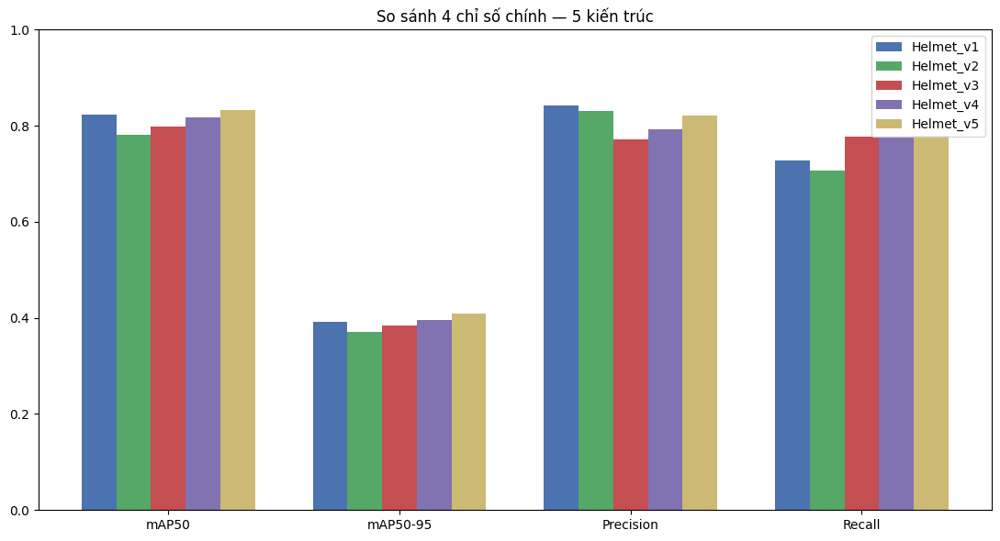
</p>
<p align="center">
  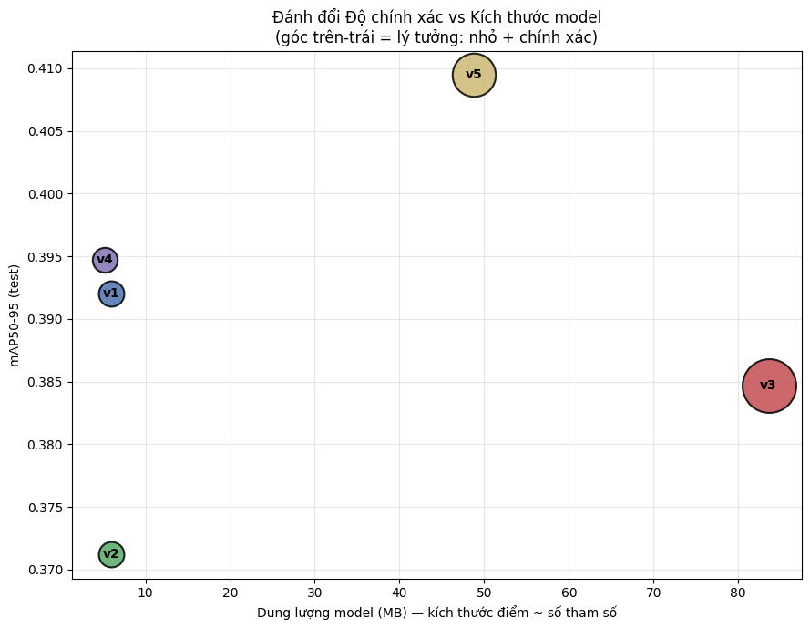
  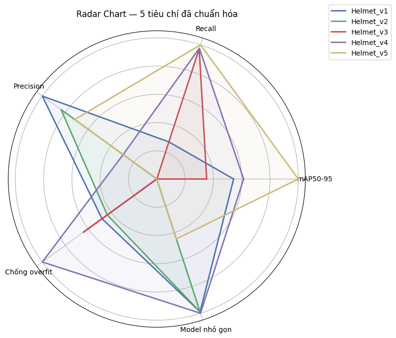
</p>
<p align="center"><sub>So sánh trực quan 5 kiến trúc: <code>v3</code>/<code>v5</code> (đường tròn lớn, kiến trúc "large") đổi mAP lấy dung lượng gấp nhiều lần — không nằm ở góc lý tưởng (nhỏ + chính xác) như <code>v1</code>/<code>v4</code>.</sub></p>

<p align="center">
  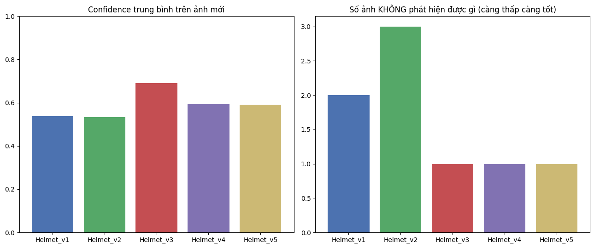
</p>
<p align="center"><sub>Kiểm thử thêm trên ảnh mới ngoài tập test: <code>v1</code> cân bằng tốt giữa độ tự tin và tỉ lệ bỏ sót thấp.</sub></p>

<table align="center">
<tr>
  <td>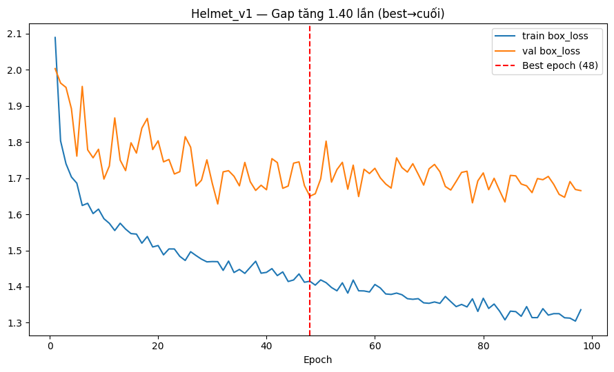</td>
  <td>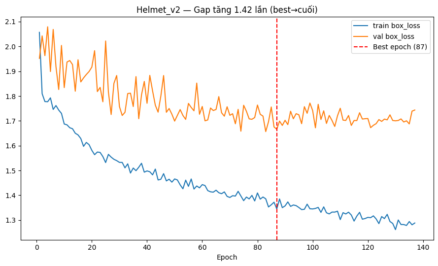</td>
</tr>
<tr>
  <td>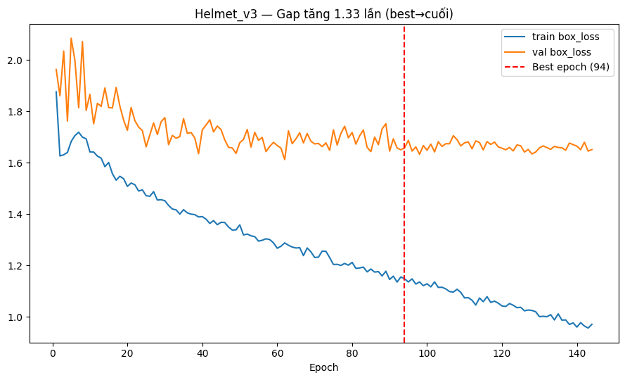</td>
  <td>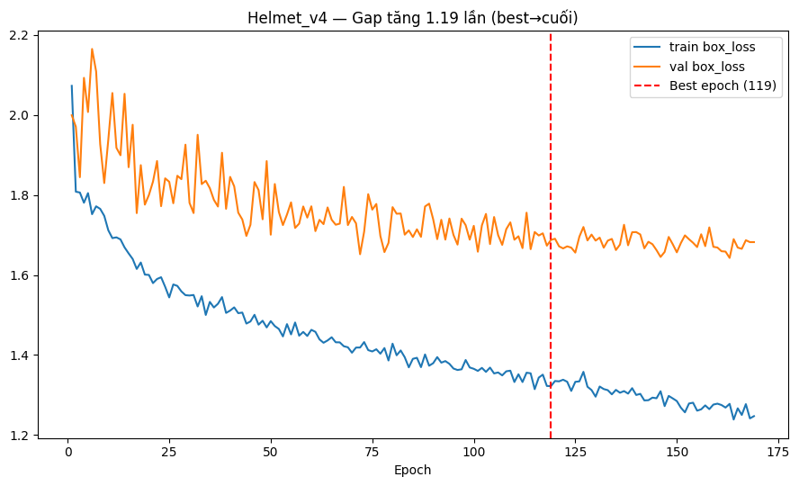</td>
</tr>
<tr>
  <td>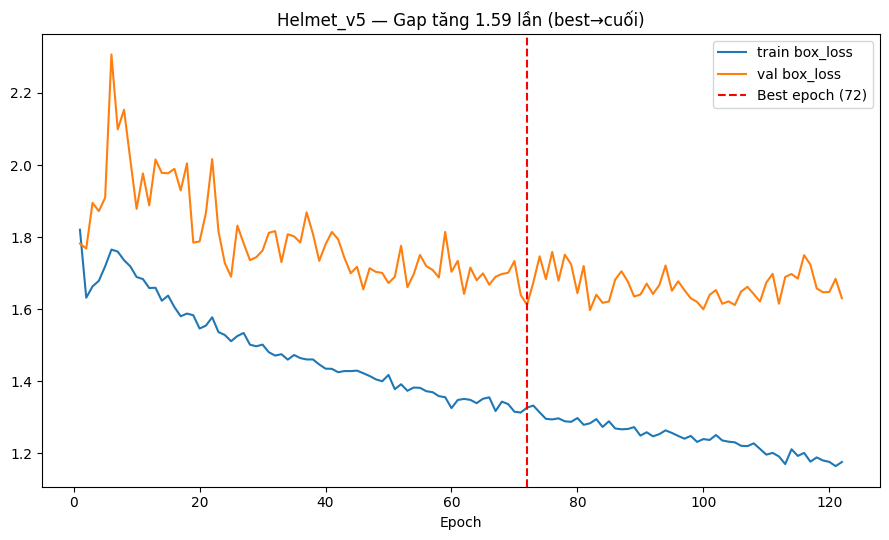</td>
  <td>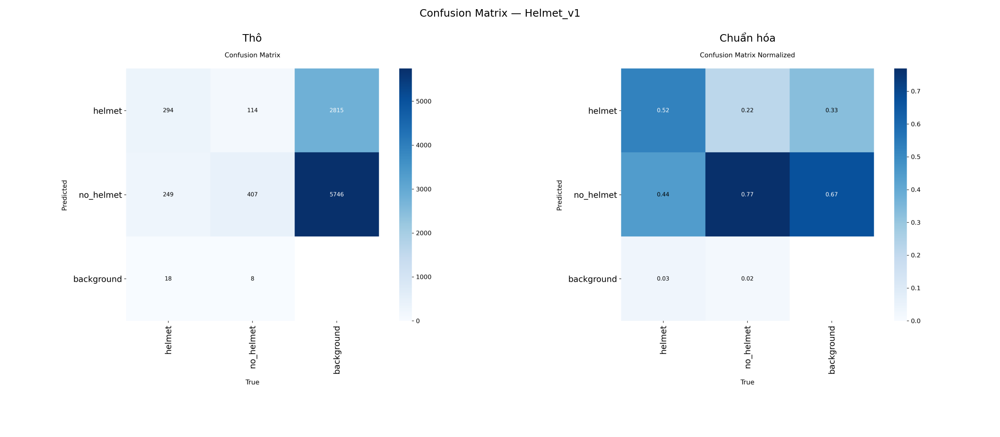</td>
</tr>
</table>
<p align="center"><sub>Đường cong train/val box_loss theo epoch của cả 5 nhánh (đường đỏ đứt = epoch tốt nhất trước khi bắt đầu overfit) và ma trận nhầm lẫn của <code>Helmet_v1</code> — model được chọn làm Proposed chính thức.</sub></p>

## 11. Kiểm chứng chất lượng

Mỗi tính năng trong hệ thống đều được xác minh có căn cứ, không chỉ chạy thử qua loa:

- Công cụ tự viết đo số lần 2 track khác mã theo dõi bị chồng lấp cao (nghi ngờ 1 xe bị tách
  thành nhiều khung bao) mỗi khi đổi model/tham số theo dõi.
- Công cụ tự viết đo số track bị "gãy" (1 xe di chuyển liên tục nhưng bị đổi mã theo dõi giữa
  chừng dù không hề biến mất khỏi khung hình).
- Mọi vi phạm phát hiện được đều được trích xuất khung hình cụ thể để kiểm tra bằng mắt trước khi
  kết luận đúng/sai — không chỉ tin vào số đếm tổng.
- Kiểm thử chéo trên nhiều video khác nhau (cùng góc quay nhưng nội dung khác, hoặc góc quay hoàn
  toàn khác) để phát hiện các trường hợp cấu hình/tham số chỉ đúng cho 1 video cụ thể mà không
  tổng quát hoá được.
- Mọi thay đổi tham số/rule đều được đo lại toàn bộ số liệu trước/sau (số vi phạm theo từng loại,
  tổng số phương tiện, tốc độ xử lý) để xác nhận không gây hồi quy ở các video khác đã hoạt động
  đúng từ trước.

## 12. Hướng phát triển tiếp theo

- Xây dựng hoàn chỉnh luồng "phạt nguội": kết nối cơ sở dữ liệu đăng ký phương tiện/dân cư để tra
  cứu chủ xe theo biển số, tự động sinh biên bản và gửi thông báo, theo đúng quy trình 5 bước thực
  tế tại Việt Nam.
- Nghiên cứu giải pháp cho vấn đề tracker "hồi sinh" nhầm đối tượng — hướng khả thi là bổ sung đặc
  trưng hình ảnh (appearance embedding/Re-ID) vào bước đối chiếu track.
- Thu thập bổ sung dữ liệu huấn luyện mũ bảo hiểm cho các điều kiện còn yếu (mũ màu tối, ánh sáng
  yếu/ngược sáng) và huấn luyện lại.
- Tối ưu sâu hơn cho video độ phân giải cao/mật độ phương tiện lớn bằng xuất mô hình sang định
  dạng suy luận chuyên dụng (ONNX Runtime/TensorRT).
- Mở rộng hỗ trợ giám sát đồng thời nhiều camera trong cùng 1 phiên hệ thống (hàng đợi xử lý đa
  nguồn) thay vì giới hạn 1 nguồn tại 1 thời điểm như hiện tại.
- Bổ sung lại rule vượt tốc độ giới hạn — đã chủ động loại khỏi phạm vi vì video thử nghiệm hiện
  có không có mốc khoảng cách thật để hiệu chỉnh camera (camera calibration).
- Mở rộng thêm các loại vi phạm khác có ý nghĩa thực tiễn (đỗ xe sai quy định, đi vào làn cấm theo
  khung giờ, chở quá số người quy định...), tận dụng lại kiến trúc cấu hình theo camera hiện có.
- Tích hợp trực tiếp luồng camera IP/RTSP thực tế thay vì chỉ xử lý file video đã quay sẵn hoặc
  webcam USB như hiện tại.

---


